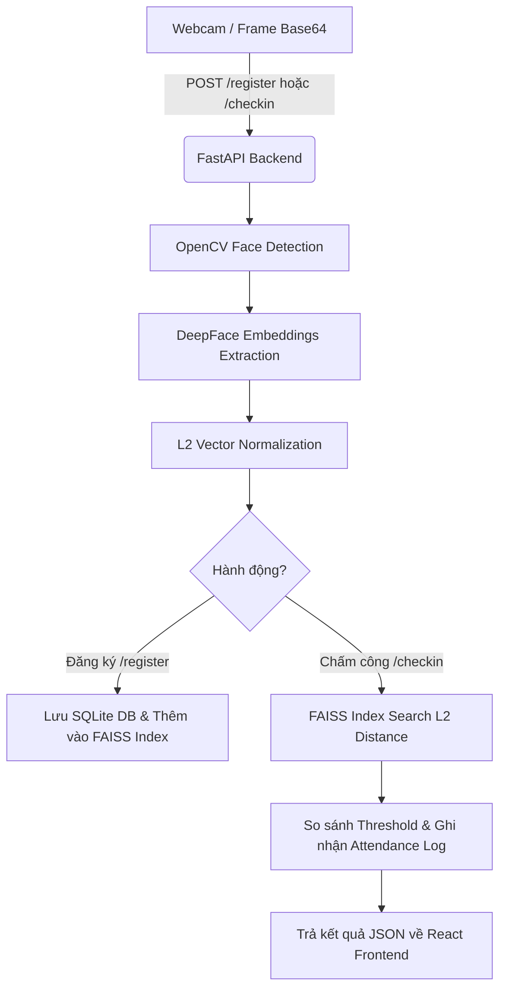

# 📸 FACE_ID - Hệ Thống Chấm Công & Nhận Diện Khuôn Mặt Thời Gian Thực (AI & FAISS Vector Search)

[](https://fastapi.tiangolo.com/)
[](https://react.dev/)
[](https://vitejs.dev/)
[](https://github.com/serengil/deepface)
[](https://github.com/facebookresearch/faiss)
[](LICENSE)

Dự án **FACE_ID** là giải pháp chấm công và quản lý nhân sự thời gian thực thông minh dựa trên trí tuệ nhân tạo (AI). Hệ thống kết hợp các mô hình Mạng Nơ-ron Sâu (Deep Neural Networks) trích xuất đặc trưng khuôn mặt cùng với động cơ tìm kiếm không gian vector tốc độ cao **FAISS (Facebook AI Similarity Search)**.

Repository GitHub: **[https://github.com/Ximoncute/FACE_ID.git](https://github.com/Ximoncute/FACE_ID.git)**

---

## 📑 Mục Lục
1. [Tính Năng Nổi Bật](#-tính-năng-nổi-bật)
2. [Kiến Trúc & Thuật Toán AI](#-kiến-trúc--thuật-toán-ai)
3. [Công Nghệ Sử Dụng](#-công-nghệ-sử-dụng)
4. [Hướng Dẫn Khởi Chạy Nhanh (1-Click Start)](#-hướng-dẫn-khởi-chạy-nhanh-1-click-start)
5. [Hướng Dẫn Cài Đặt Chi Tiết (Thủ Công)](#-hướng-dẫn-cài-đặt-chi-tiết-thủ-công)
6. [Tài Liệu Chi Tiết Về API (API Documentation)](#-tài-liệu-chi-tiết-về-api-api-documentation)
7. [Hướng Dẫn Xem Cơ Sở Dữ Liệu (Database View Guide)](#-hướng-dẫn-xem-cơ-sở-dữ-liệu-database-view-guide)
8. [Cấu Trúc Thư Mục Dự Án](#-cấu-trúc-thư-mục-dự-án)
9. [Xử Lý Sự Cố Thường Gặp (Troubleshooting)](#-xử-lý-sự-cố-thường-gặp-troubleshooting)

---

## ✨ Tính Năng Nổi Bật

- 🧬 **Trích xuất Đa Mô hình (Multi-Model Feature Extraction)**: Khi đăng ký nhân viên mới, hệ thống tự động chạy qua 3 mô hình học sâu hàng đầu là **Facenet512**, **ArcFace**, và **VGG-Face** để tạo cơ sở dữ liệu véc-tơ đa dạng.
- ⚡ **Tìm kiếm Vector Siêu tốc với FAISS**: Sử dụng thuật toán `faiss.IndexFlatL2` kết hợp chuẩn hóa khoảng cách $L_2$ (Unit-length Normalization) giúp việc so khớp khuôn mặt diễn ra trong dưới **1ms** cho hàng triệu bản ghi.
- 📷 **Chấm công thời gian thực qua Webcam**: Quét ảnh từ Webcam với tần số cao, tự động lọc và cắt vùng mặt bằng OpenCV Haar Cascade chuẩn.
- 📊 **Biểu đồ Phân tích & Benchmark (Analytics)**: Tích hợp Chart.js để trực quan hóa thời gian xử lý và độ sai lệch (Confidence Score / Distance) giữa các mô hình AI khác nhau.
- 💎 **Giao diện Glassmorphism Sang trọng**: Thiết kế giao diện hiện đại trên nền React 19 + Vite, tối ưu trải nghiệm người dùng trên máy tính và thiết bị di động.
- 🚀 **Script Khởi chạy 1-Click**: Tích hợp sẵn `run.bat` (Windows) và `run.sh` (macOS / Linux) tự động cài đặt và chạy cả Backend lẫn Frontend.

---

## 🧠 Kiến Trúc & Thuật Toán AI

### 1. Dòng chảy Xử lý Dữ liệu (Data Pipeline)


### 2. Thông số Các Mô hình AI & Ngưỡng Nhận Diện

Tất cả các vector đặc trưng sau khi trích xuất đều được đưa về độ dài đơn vị (Unit Vector: $\|v\|_2 = 1.0$). Khoảng cách Euclidean bình phương giữa 2 vector chuẩn hóa luôn nằm trong khoảng $[0.0, 2.0]$:

| Mô hình AI | Kích thước Vector (Dimensions) | Ngưỡng khoảng cách ($L_2$ Threshold) | Đặc điểm |
| :--- | :---: | :---: | :--- |
| **Facenet512** | `512` | `1.15` | Độ chính xác cao nhất, đề xuất sử dụng chính |
| **ArcFace** | `512` | `1.20` | Tối ưu hóa góc nghiêng và ánh sáng |
| **VGG-Face** | `4096` | `1.25` | Tốc độ xử lý nhanh |

---

## 🛠️ Công Nghệ Sử Dụng

### **Backend Stack**
- **Core Framework**: `FastAPI` (Python 3.10+)
- **Server Engine**: `Uvicorn` với ASGI protocol
- **AI / Deep Learning**: `DeepFace`, `TensorFlow`, `tf-keras`
- **Computer Vision**: `OpenCV` (`opencv-python 4.8.1.78`)
- **Vector Search Database**: `faiss-cpu` (Facebook AI Similarity Search)
- **Database & ORM**: `SQLite`, `SQLAlchemy`, `Pydantic v2`

### **Frontend Stack**
- **UI Framework**: `React 19`
- **Build Tool**: `Vite 8`
- **Webcam Stream**: `react-webcam`
- **Charts & Graphics**: `chart.js`, `react-chartjs-2`
- **HTTP Client**: `axios`

---

## 🚀 Hướng Dẫn Khởi Chạy Nhanh (1-Click Start)

### 🪟 Trên Windows
Chỉ cần mở thư mục dự án và click đúp chuột vào file **`run.bat`** (hoặc chạy trong PowerShell):
```powershell
.\run.bat
```
> Script sẽ tự động bật 2 cửa sổ Command Prompt cho Backend (`http://127.0.0.1:8000`) và Frontend (`http://localhost:5173`).

---

### 🐧 🍎 Trên macOS hoặc Linux
Mở Terminal tại thư mục dự án và chạy câu lệnh:
```bash
chmod +x run.sh
./run.sh
```
> Script `run.sh` sẽ tự kiểm tra môi trường ảo `venv`, cài đặt thư viện thiếu nếu cần, sau đó chạy ngầm cả Backend và Frontend song song. Nhấn `Ctrl+C` để dừng tất cả dịch vụ.

---

## 📦 Hướng Dẫn Cài Đặt Chi Tiết (Thủ Công)

Nếu bạn muốn tùy chỉnh môi trường hoặc chạy riêng lẻ từng phần:

### 1. Cài đặt Backend (FastAPI)

```bash
# 1. Chuyển vào thư mục backend
cd backend

# 2. Tạo môi trường ảo Python venv
python3 -m venv venv

# 3. Kích hoạt môi trường ảo
# Trên Windows:
.\venv\Scripts\activate
# Trên macOS / Linux:
source venv/bin/activate

# 4. Đảm bảo hạ cấp numpy<2 để tương thích OpenCV & TensorFlow
pip install "numpy<2"

# 5. Cài đặt tất cả các thư viện cần thiết
pip install -r requirements.txt

# 6. Chạy Backend Server với Host 127.0.0.1
uvicorn app.main:app --host 127.0.0.1 --port 8000 --reload
```
📍 **Backend Swagger UI**: [http://127.0.0.1:8000/docs](http://127.0.0.1:8000/docs)

---

### 2. Cài đặt Frontend (React + Vite)

```bash
# 1. Mở terminal riêng và chuyển vào thư mục frontend
cd frontend

# 2. Cài đặt các gói phụ thuộc NPM
npm install

# 3. Chạy môi trường phát triển Vite
npm run dev
```
📍 **Frontend Web App**: [http://localhost:5173](http://localhost:5173)

---

## 📡 Tài Liệu Chi Tiết Về API (API Documentation)

### 1. Đăng ký Nhân viên (`POST /register`)
- **Content-Type**: `multipart/form-data`
- **Body Params**:
  - `name` (string): Tên nhân viên.
  - `image` (string): Chuỗi base64 của ảnh đại diện chụp từ camera (`data:image/jpeg;base64,...`).
- **Phản hồi mẫu (200 OK)**:
  ```json
  {
    "id": 1,
    "name": "Nguyễn Văn A",
    "created_at": "2026-07-29T04:50:00"
  }
  ```

### 2. Chấm công Khuôn mặt (`POST /checkin`)
- **Content-Type**: `multipart/form-data`
- **Body Params**:
  - `image` (string): Ảnh base64 cần điểm danh.
  - `model_name` (string): Thuật toán sử dụng (`Facenet512`, `ArcFace`, hoặc `VGG-Face`).
- **Phản hồi mẫu (200 OK)**:
  ```json
  {
    "user_id": 1,
    "name": "Nguyễn Văn A",
    "confidence": 0.4215,
    "model_used": "Facenet512",
    "time_taken_ms": 185.4
  }
  ```

### 3. Xem Lịch sử Chấm công (`GET /logs`)
- **Phản hồi mẫu**: Danh sách 50 lượt chấm công mới nhất.

### 4. Benchmark So sánh Mô hình (`GET /analytics/compare`)
- **Phản hồi mẫu**: Thời gian trích xuất trung bình (ms) của từng mô hình AI.

---

## 🗄️ Hướng Dẫn Xem Cơ Sở Dữ Liệu (Database View Guide)

Cơ sở dữ liệu của hệ thống được lưu trữ dưới dạng **SQLite** tại đường dẫn: `backend/attendance.db` (chứa 3 bảng chính: `users`, `face_embeddings`, `attendance_logs`).

Dưới đây là 3 cách đơn giản để xem và truy vấn dữ liệu:

### 1. Sử dụng phần mềm Giao diện GUI (Dễ xem nhất - Khuyên dùng)
- **DB Browser for SQLite (Miễn phí & Nhẹ)**: Tải tại [https://sqlitebrowser.org/](https://sqlitebrowser.org/), nhấn **Open Database** và chọn file `backend/attendance.db`.
- **VS Code / Antigravity IDE Extension**: Cài đặt extension **SQLite Viewer**, sau đó click đúp trực tiếp vào file `backend/attendance.db` để xem bảng dữ liệu.

### 2. Chạy Script in dữ liệu ra Terminal (`view_db.py`)
Mở Terminal và thực hiện câu lệnh:
```bash
python backend/view_db.py
# Hoặc trên Windows venv:
.\backend\venv\Scripts\python.exe backend\view_db.py
```
> Script sẽ tự động in danh sách Nhân viên (`users`), Vector đặc trưng (`face_embeddings`) và Lịch sử chấm công (`attendance_logs`) dạng bảng sạch sẽ.

### 3. Xem trực tuyến dạng JSON qua Swagger API Docs
Khi Backend đang chạy (`http://127.0.0.1:8000`), truy cập đường dẫn API Docs:
- **URL**: [http://127.0.0.1:8000/docs](http://127.0.0.1:8000/docs)
- Tìm endpoint **`GET /logs`** ➔ nhấn **Try it out** ➔ **Execute** để xem dữ liệu JSON phản hồi trực tiếp.

---

## 📂 Cấu Trúc Thư Mục Dự Án

```text
FACE_ID/
├── backend/
│   ├── app/
│   │   ├── core/
│   │   │   ├── ai_models.py      # Trích xuất vector đặc trưng DeepFace & L2 Normalize
│   │   │   ├── vector_search.py  # Quản lý FAISS Index & Tự động khớp kích thước Vector
│   │   │   └── evaluator.py      # Benchmark các mô hình AI
│   │   ├── database.py           # Khởi tạo SQLite connection & Session
│   │   ├── models.py             # SQLAlchemy DB Models (User, FaceEmbedding, AttendanceLog)
│   │   ├── schemas.py            # Pydantic Schemas (Request/Response)
│   │   └── main.py               # FastAPI App & Endpoints
│   ├── attendance.db             # Cơ sở dữ liệu SQLite (Tự động khởi tạo)
│   └── requirements.txt          # Danh sách thư viện Python
├── frontend/
│   ├── src/
│   │   ├── pages/
│   │   │   ├── Register.jsx      # Giao diện Đăng ký nhân viên mới
│   │   │   ├── CheckIn.jsx       # Giao diện Chấm công trực tiếp qua Webcam
│   │   │   └── Analytics.jsx     # Giao diện Biểu đồ phân tích hiệu năng
│   │   ├── App.jsx               # Navigation & Layout
│   │   └── main.jsx              # Entry point React
│   ├── package.json              # NPM Dependencies
│   └── vite.config.js
├── run.bat                       # Script 1-Click trên Windows
├── run.sh                        # Script 1-Click trên macOS / Linux
├── .gitignore                    # Bỏ qua node_modules, venv, pycache, .db
└── README.md                     # Tài liệu hướng dẫn dự án
```

---

## 🛠️ Xử Lý Sự Cố Thường Gặp (Troubleshooting)

### 1. Lỗi `Network Error` hoặc `Lỗi kết nối tới server`
- **Nguyên nhân**: Frontend gọi tới `localhost:8000` nhưng trên Windows, `localhost` phân giải IPv6 (`::1`) trong khi Uvicorn lắng nghe IPv4 (`127.0.0.1`).
- **Giải pháp**: Tất cả file Frontend đã được cập nhật đường dẫn chuẩn: `http://127.0.0.1:8000`. Đảm bảo cửa sổ Backend đã bật và hiển thị: `Uvicorn running on http://127.0.0.1:8000`.

### 2. Lỗi `ValueError: Expected dimension 2622, got 4096`
- **Nguyên nhân**: Mô hình `VGG-Face` trong các bản DeepFace gần đây xuất ra vector kích thước 4096 thay vì 2622.
- **Giải pháp**: File `vector_search.py` đã tích hợp cơ chế tự động phát hiện số chiều (Auto-adapt dimensions) cho FAISS Index nên lỗi này đã được xử lý triệt để.

### 3. Lỗi `ImportError: numpy.core.multiarray failed to import`
- **Nguyên nhân**: Thư viện OpenCV và TensorFlow yêu cầu `numpy < 2.0.0`.
- **Giải pháp**: Chạy lệnh `pip install "numpy<2"` để cài phiên bản NumPy `1.26.4` tương thích.

---

## 📜 Giấy Phép & Tác Giả

- **Tác giả**: [Ximoncute](https://github.com/Ximoncute)
- **Repository**: [https://github.com/Ximoncute/FACE_ID.git](https://github.com/Ximoncute/FACE_ID.git)
- **Giấy phép**: Phát hành theo giấy phép [MIT License](LICENSE).
